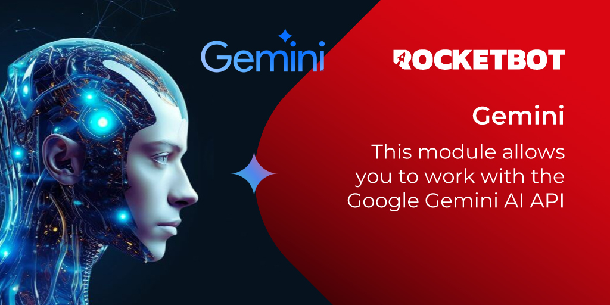

# Gemini
  
Este módulo te permite trabajar con la API de inteligencia artificial de Google Gemini  

*Read this in other languages: [English](Manual_Gemini.md), [Português](Manual_Gemini.pr.md), [Español](Manual_Gemini.es.md)*
  

## Como instalar este módulo
  
Para instalar el módulo en Rocketbot Studio, se puede hacer de dos formas:
1. Manual: __Descargar__ el archivo .zip y descomprimirlo en la carpeta modules. El nombre de la carpeta debe ser el mismo al del módulo y dentro debe tener los siguientes archivos y carpetas: \__init__.py, package.json, docs, example y libs. Si tiene abierta la aplicación, refresca el navegador para poder utilizar el nuevo modulo.
2. Automática: Al ingresar a Rocketbot Studio sobre el margen derecho encontrara la sección de **Addons**, seleccionar **Install Mods**, buscar el modulo deseado y presionar install.  

## Cómo usar este módulo

Para usar este módulo, necesitamos obtener la clave API de Gemini. Sigue estos pasos:

1. Ve a la [página de claves API de Gemini](https://aistudio.google.com/app/apikey). Asegúrate de estar conectado con tu cuenta de Google.
2. Haz clic en el botón "Crear clave API".
3. Copia la clave API generada.
4. Usa esta clave API en el módulo para la autenticación y acceso a los servicios de Gemini.
## Descripción de los comandos

### Conectar a Gemini
  
Conecta a la API de Google Gemini
|Parámetros|Descripción|ejemplo|
| --- | --- | --- |
|API Key|API Key|AIza....|
|Asignar resultado a variable|Variable donde se almacenará el resultado de la conexión|result|

### Generar Contenido
  
Genera contenido proporcionando un prompt de la información que deseas
|Parámetros|Descripción|ejemplo|
| --- | --- | --- |
|Prompt|Texto que se utilizará como prompt para generar el contenido|¿Qué es Rocketbot?|
|Asignar resultado a variable|Variable donde se almacenará el resultado de la ejecución|result|

### Leer Imagen
  
Genera contenido proporcionando una imagen de la ruta de archivo que desees
|Parámetros|Descripción|ejemplo|
| --- | --- | --- |
|Prompt|Texto que se utilizará como prompt para generar el contenido a partir de la imagen|¿Qué puedes ver en la imagen?|
|Imagen|Archivo que se utilizará como prompt para generar el contenido|Selecciona un archivo|
|Asignar resultado a variable|Variable donde se almacenará el resultado de la ejecución|result|

### Generar Contenido Desde txt
  
Genera contenido proporcionando un archivo .txt de la información que deseas
|Parámetros|Descripción|ejemplo|
| --- | --- | --- |
|Prompt|Texto que se utilizará como prompt para generar el contenido|¿Qué lees en el archivo txt?|
|Archivo|Archivo que se utilizará como prompt para generar el contenido|Selecciona un archivo|
|Asignar resultado a variable|Variable donde se almacenará el resultado de la ejecución|result|

### Generar Contenido Desde pdf
  
Genera contenido proporcionando un archivo .pdf de la información que deseas
|Parámetros|Descripción|ejemplo|
| --- | --- | --- |
|Prompt|Texto que se utilizará como prompt para generar el contenido|¿Qué lees en el archivo pdf?|
|Archivo|Archivo que se utilizará como prompt para generar el contenido|Selecciona un archivo|
|Asignar resultado a variable|Variable donde se almacenará el resultado de la ejecución|result|

### Generar Contenido Desde Audio
  
Genera contenido proporcionando un archivo de audio de la información que deseas
|Parámetros|Descripción|ejemplo|
| --- | --- | --- |
|Prompt|Texto que se utilizará como prompt para generar el contenido|¿Qué escuchar en el audio?|
|Archivo|Archivo que se utilizará como prompt para generar el contenido|Selecciona un archivo|
|Asignar resultado a variable|Variable donde se almacenará el resultado de la ejecución|result|
