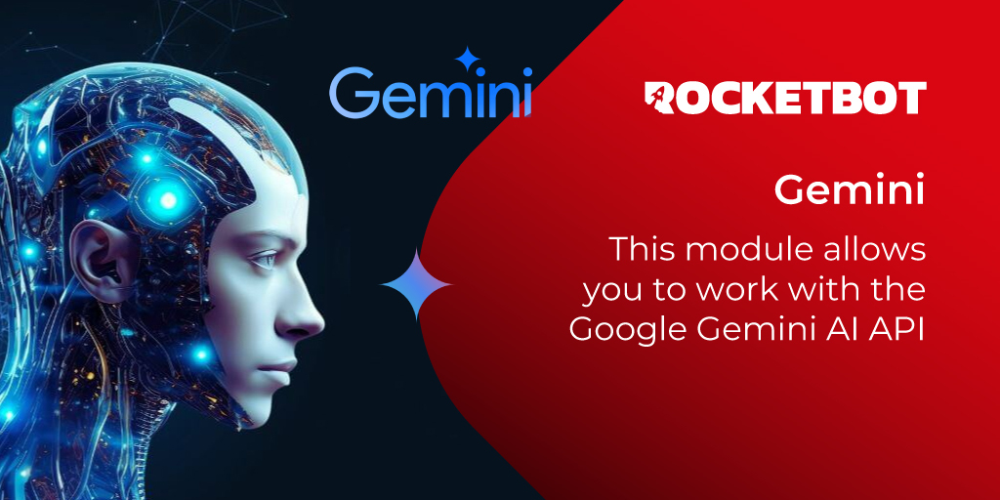

# Gemini
  
This module allows you to work with the Google Gemini AI API  

*Read this in other languages: [English](Manual_Gemini.md), [Português](Manual_Gemini.pr.md), [Español](Manual_Gemini.es.md)*

## How to install this module
  
To install the module in Rocketbot Studio, it can be done in two ways:
1. Manual: __Download__ the .zip file and unzip it in the modules folder. The folder name must be the same as the module and inside it must have the following files and folders: \__init__.py, package.json, docs, example and libs. If you have the application open, refresh your browser to be able to use the new module.
2. Automatic: When entering Rocketbot Studio on the right margin you will find the **Addons** section, select **Install Mods**, search for the desired module and press install.  

## How to use this module

To use this module, we need to obtain the API key from Gemini. Follow these steps:

1. Go to the [Gemini API Key page](https://aistudio.google.com/app/apikey). Ensure you are logged in with your Google account.
2. Click on the "Create API key" button.
3. Copy the generated API key.
4. Use this API key in the module for authentication and access to Gemini services.
## Description of the commands

### Connect to Gemini
  
Connect to the Google Gemini API
|Parameters|Description|example|
| --- | --- | --- |
|API Key|API Key|AIza....|
|Assign result to variable|Variable where the connection result will be stored|result|

### Generate Content
  
Generate content by providing a prompt of the information you want
|Parameters|Description|example|
| --- | --- | --- |
|Prompt|Text that will be used as a prompt to generate the content|What is Rocketbot?|
|Assign result to variable|Variable where the execution result will be stored|result|

### Read Image
  
Generate content by providing a prompt with a file route you want
|Parameters|Description|example|
| --- | --- | --- |
|Prompt|Text that will be used as a prompt to generate the content from the image|What can you see in the image?|
|Image|File that will be used as a prompt to generate the content|Select a file|
|Assign result to variable|Variable where the execution result will be stored|result|

### Generate Content From txt
  
Generate content by providing a .txt file of the information you want
|Parameters|Description|example|
| --- | --- | --- |
|Prompt|Text that will be used as a prompt to generate the content|What do you read in the txt file?|
|File|File that will be used as a prompt to generate the content|Select a file|
|Assign result to variable|Variable where the execution result will be stored|result|

### Generate Content From pdf
  
Generate content by providing a .pdf file of the information you want
|Parameters|Description|example|
| --- | --- | --- |
|Prompt|Text that will be used as a prompt to generate the content|What do you read in the pdf file?|
|File|File that will be used as a prompt to generate the content|Select a file|
|Assign result to variable|Variable where the execution result will be stored|result|

### Generate Content From Audio
  
Generate content by providing an audio file of the information you want
|Parameters|Description|example|
| --- | --- | --- |
|Prompt|Text that will be used as a prompt to generate the content|What do you listen in the audio?|
|File|File that will be used as a prompt to generate the content|Select a file|
|Assign result to variable|Variable where the execution result will be stored|result|
